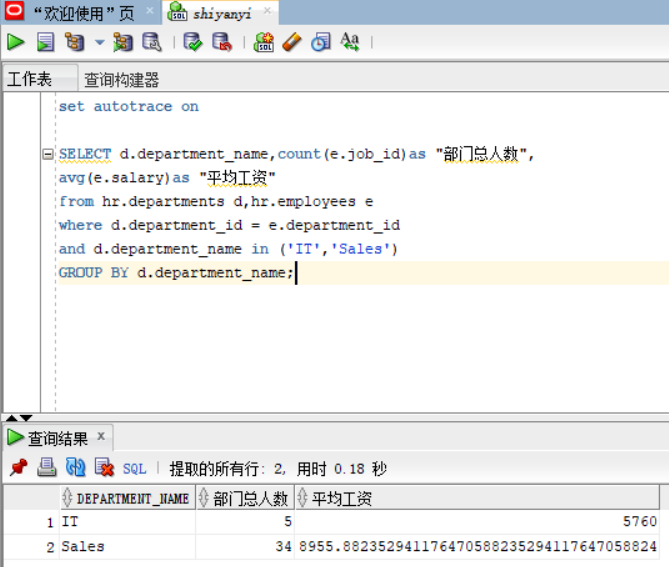
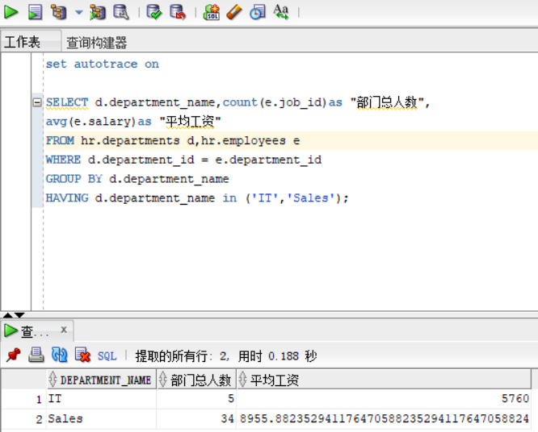
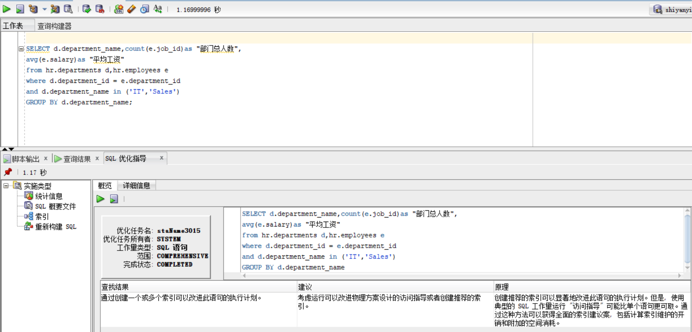
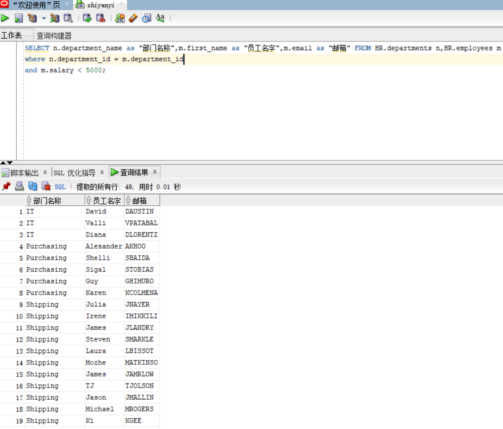

# oracle
# 姓名：何海翔
# 学号：201810414209
#

## 实验目的
### 分析SQL执行计划，执行SQL语句的优化指导。理解分析SQL语句的执行计划的重要作用。

## 实验内容
### ·对Oracle12c中的HR人力资源管理系统中的表进行查询与分析。
### ·首先运行和分析教材中的样例：本训练任务目的是查询两个部门('IT'和'Sales')的部门总人数和平均工资，以下两个查询的结果是一样的。但效率不相同。
### ·设计自己的查询语句，并作相应的分析，查询语句不能太简单。

### 由上面两个查询截图可知，两个查询语句的结果相同，两个部门('IT'和'Sales')的部门总人数和平均工资。但是，上面的两个查询语句的执行效率却不同，第一个查询语句的运行时间有0.18秒，而第二个查询语句的执行时间是0.188秒。所以这两查询语句中，第一个查询语句更优.

### 由上图可知，第一个查询语句虽然运行时间较少，但是它并不是完美的，在sqldeveloper的优化指导工具中我们知道了该如何优化，优化方式如上图。
## 自行设计的查询语句

### 我自己设计的查找语句是查找的部门名称，员工名字以及员工的邮箱号，查找条件是工资低于5000。所以最终查找出来的结果是工资低于5000的员工所在部门以及员工的邮箱号。
