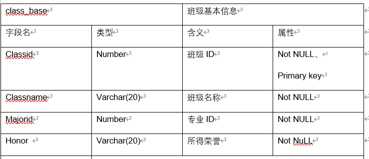
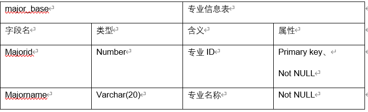

# 期末实践项目

### 姓名：何海翔  

### 学号：201810414209

### 班级：2018级2班

## 流程结构  
+ 创建数据库
+ 构思数据表
+ 插入数据
+ 用户赋权
+ 构建程序包
+ 备份数据库
+ DataGuard

### 创建数据库  
1.利用Linux终端键入“dbca”，创建属于自己的数据库（pdb），命名为“SsManager”,基于orcl数据库（cdb）下。  
进入dbca可以发现，SsManager的数据库（pdb）已经创建完成。  
  

2.在orcl数据库中，改变sys,system密码、创建新用户等。  
+ 进入SQLPlus  
```
sqlplus /nolog
conn /as sysdba

```
+  修改密码  
```
alter user sys identified by 密码 --修改sys密码
alter user system identified by 密码 --修改system密码

```
  

+ 创建全局新用户（未用到，只是提及）
```
create user c##DaiRui identified by 12345678;   --创建新用户
GRANT CREATE SESSION  TO  c##DaiRui;            --连接数据库权限
GRANT CREATE TABLE  TO c##DaiRui;                  --创建table权限
GRANT UNLIMITED TABLESPACE TO c##DaiRui;   --任意使用表空间
GRANT select any table TO c##create DaiRui;  --select other table

```

    


+ 使用SQL developer连接数据库，或者使用SQLplus测试连接（未用到，只是提及）
=======
  

+ 使用SQL developer连接数据库，或者使用SQLplus测试连接   

```
conn c##DaiRui
Enter password:********
connected.
Session altered.

```
     

+ 在SsManager中创建两个表空间(通过System用户)  
+ 1.创建Student_tablespace  
```
create tablespace Student_tablespace 
datafile '/home/oracle/app/oracle/oradata/orcl/SsManager/Student.dbf' 
size 1000M;
```
```
Tablespace STUDENT_TABLESPACE 已创建。
```
+ 2.创建Course_tablespace
```
create tablespace Course_tablespace 
datafile '/home/oracle/app/oracle/oradata/orcl/SsManager/Course.dbf' 
size 1000M;

```
```
Tablespace COURSE_TABLESPACE 已创建。
```
+ 创建结果  

  

### 构思数据表
+ 班级信息表
+ 学生信息表
+ 学业信息表
+ 课程信息表
+ 专业信息表  

1.班级信息表   
```
班级信息表class_base:
用于保存班级基本信息.包括班级号,专业号，班级人数,成绩,所获荣誉等；
```
  

```
1.	CREATE TABLE CLASS_BASE 
2.	(
3.	CLASSID NUMBER NOT NULL 
4.	, CLASSNAME VARCHAR2(20) NOT NULL 
5.	, MAJORID NUMBER NOT NULL 
6.	, HONOR VARCHAR2(50) 
7.	, CONSTRAINT CLASS_BASE_PK PRIMARY KEY 
8.	(
CLASSID 
9.	)
10.	ENABLE 
11.	) 
12.	LOGGING 
13.	TABLESPACE STUDENT_TABLESPACE 
14.	STORAGE 
15.	( 
16.	BUFFER_POOL DEFAULT 
17.	) 
18.	INMEMORY 
19.	PARALLEL;

20.	ALTER TABLE CLASS_BASE
21.	ADD CONSTRAINT CLASS_BASE_FK1 FOREIGN KEY
22.	(
23.	  MAJORID 
24.	)
25.	REFERENCES MAJOR_BASE
26.	(
27.	  MAJORID 
28.	)
29.	ENABLE;

```
2.学生信息表  
```
学生个人信息表student_base：
用于保存学生的学号,姓名,性别,年龄,所在学院,专业、班级号,入学年份等信息；
```
    

```
1.	CREATE TABLE STUDENT_BASE 
2.	(
3.	STUDENTID NUMBER NOT NULL 
4.	, NAME VARCHAR2(20 BYTE) NOT NULL 
5.	, AGE NUMBER(*, 0) NOT NULL 
6.	, SEX VARCHAR2(5 BYTE) NOT NULL 
7.	, COLLEGE VARCHAR2(20 BYTE) NOT NULL 
8.	, MAJORID NUMBER NOT NULL 
9.	, YEAR DATE NOT NULL 
10.	, CLASSID NUMBER NOT NULL 
11.	, CONSTRAINT STUDENT_BASE_PK PRIMARY KEY 
12.	(
a)	STUDENTID 
13.	)
14.	USING INDEX 
15.	(
CREATE UNIQUE INDEX STUDENT_BASE_PK ON STUDENT_BASE (STUDENTID ASC) 
LOGGING 
TABLESPACE STUDENT_TABLESPACE 
PCTFREE 10 
INITRANS 2 
STORAGE 
( 
BUFFER_POOL DEFAULT 
) 
NOPARALLEL 
16.	)
17.	ENABLE 
18.	) 
19.	LOGGING 
20.	TABLESPACE STUDENT_TABLESPACE 
21.	PCTFREE 10 
22.	INITRANS 1 
23.	STORAGE 
24.	( 
25.	BUFFER_POOL DEFAULT 
26.	) 
27.	NOCOMPRESS 
28.	NO INMEMORY 
29.	NOPARALLEL;

30.	ALTER TABLE STUDENT_BASE
31.	ADD CONSTRAINT STUDENT_BASE_FK1 FOREIGN KEY
32.	(
33.	CLASSID 
34.	)
35.	REFERENCES CLASS_BASE
36.	(
37.	CLASSID 
38.	)
39.	ENABLE;

30.	ALTER TABLE CLASS_BASE
31.	ADD CONSTRAINT CLASS_BASE_FK1 FOREIGN KEY
32.	(
33.	  MAJORID 
34.	)
35.	REFERENCES MAJOR_BASE
36.	(
37.	  MAJORID 
38.	)
ENABLE;

```
3.学业信息表  

```
学业信息表course_score:
用于保存学生成绩信息,包括学号,课程号,学分，成绩等字段；
```
  

```
1.	CREATE TABLE COURSE_SCORE 
2.	(
3.	COURSEID NUMBER NOT NULL 
4.	, STUDENTID NUMBER NOT NULL 
5.	, SCORE NUMBER(4, 2) NOT NULL 
6.	, PASS VARCHAR2(2 BYTE) NOT NULL 
7.	) 
8.	LOGGING 
9.	TABLESPACE USERS 
10.	PCTFREE 10 
11.	INITRANS 1 
12.	STORAGE 
13.	( 
14.	BUFFER_POOL DEFAULT 
15.	) 
16.	NOCOMPRESS 
17.	NO INMEMORY 
18.	NOPARALLEL;

19.	ALTER TABLE COURSE_SCORE
20.	ADD CONSTRAINT COURSE_SCORE_FK1 FOREIGN KEY
21.	(
22.	STUDENTID 
23.	)
24.	REFERENCES STUDENT_BASE
25.	(
26.	STUDENTID 
27.	)
28.	ENABLE;

29.	ALTER TABLE COURSE_SCORE
30.	ADD CONSTRAINT COURSE_SCORE_FK2 FOREIGN KEY
31.	(
32.	COURSEID 
33.	)
34.	REFERENCES COURSE_BASE
35.	(
36.	COURSEID 
37.	)
38.	ENABLE;

```
4.课程信息表  

```
课程信息表course_base:
用于保存课程信息,包括课程名,课程号。
```
  

```
1.	CREATE TABLE COURSE_BASE 
2.	(
3.	COURSEID NUMBER NOT NULL 
4.	, COURSENAME VARCHAR2(20 BYTE) NOT NULL 
5.	, CREDIT NUMBER(2, 1) NOT NULL 
6.	, CONSTRAINT COURSE_BASE_PK PRIMARY KEY 
7.	(
a)	COURSEID 
8.	)
9.	USING INDEX 
10.	(
CREATE UNIQUE INDEX COURSE_BASE_PK ON COURSE_BASE (COURSEID ASC) 
LOGGING 
TABLESPACE COURSE_TABLESPACE 
PCTFREE 10 
INITRANS 2 
STORAGE 
( 
BUFFER_POOL DEFAULT 
) 
NOPARALLEL 
11.	)
12.	ENABLE 
13.	) 
14.	LOGGING 
15.	TABLESPACE COURSE_TABLESPACE 
16.	PCTFREE 10 
17.	INITRANS 1 
18.	STORAGE 
19.	( 
20.	BUFFER_POOL DEFAULT 
21.	) 
22.	NOCOMPRESS 
23.	NO INMEMORY 
24.	NOPARALLEL;

25.	COMMENT ON COLUMN COURSE_BASE.CREDIT IS 'xuefen';

```
5.专业信息表  
```
专业信息表major_base:
用于保存专业基本信息，包括专业号，专业人数，专业成绩，专业所得荣誉。
```
  

```
1.	CREATE TABLE MAJOR_BASE 
2.	(
3.	MAJORID NUMBER NOT NULL 
4.	, MAJORNAME VARCHAR2(20 BYTE) NOT NULL 
5.	, CONSTRAINT MAJOR_BASE_PK PRIMARY KEY 
6.	(
a)	MAJORID 
7.	)
8.	USING INDEX 
9.	(
CREATE UNIQUE INDEX MAJOR_BASE_PK ON MAJOR_BASE (MAJORID ASC) 
LOGGING 
TABLESPACE COURSE_TABLESPACE 
PCTFREE 10 
INITRANS 2 
STORAGE 
( 
BUFFER_POOL DEFAULT 
) 
NOPARALLEL 
10.	)
11.	ENABLE 
12.	) 
13.	LOGGING 
14.	TABLESPACE COURSE_TABLESPACE 
15.	PCTFREE 10 
16.	INITRANS 1 
17.	STORAGE 
18.	( 
19.	BUFFER_POOL DEFAULT 
20.	) 
21.	NOCOMPRESS 
22.	NO INMEMORY 
23.	NOPARALLEL;
```
6.创建结果  

  

### 插入数据  
- 写入student_base:1w条  
```
1.	declare  
2.	Studentid number;  
3.	Name varchar2(20);  
4.	Age number;
5.	Sex varchar2(5);
6.	College varchar2(20);
7.	Majorid number;
8.	Year Date;
9.	Classid number;
10.	begin  
11.	delete from student_base;  
12.	for i in 1..10000  
13.	loop  
14.	Studentid:=i; 
15.	Name :='Dai'|| i;
16.	if ceil(i/5000) =1 then
17.	Sex :='男';
18.	else Sex :='女';
19.	end if;
20.	Age :=dbms_random.value(18,19);
21.	College :='信息科学学院';

22.	if ceil(i/3000) =1 then
23.	Year :=to_date('2017-9-9','yyyy-mm-dd');
24.	elsif ceil(i/6000) =2 then
25.	Year :=to_date('2018-9-9','yyyy-mm-dd');
26.	else
27.	Year :=to_date('2019-9-9','yyyy-mm-dd');
28.	end if;
29.	Majorid :=ceil((i/2000));
30.	Classid :=ceil((i/500));

31.	insert /*+append*/ into STUDENT_BASE(STUDENTID,NAME,AGE,SEX,College,MAJORID,YEAR,CLASSID)   
32.	values (Studentid,Name,Age,Sex,College,Majorid,Year,Classid);  
33.	end loop;
34.	end; 
```

 

- 写入course_score:4w条  
```
36.	declare  
37.	Studentid number;  
38.	Courseid number;
39.	Score number(4,2);
40.	Pass varchar2(2);
41.	begin  
42.	delete from COURSE_SCORE;  
43.	for i in 1..10000  
44.	loop  
45.	Studentid:=i; 
46.	for j in 1..4
47.	loop
48.	Courseid :=j;
49.	Score :=dbms_random.value(55.00,80.50);
50.	if Score>60 then
51.	Pass :='Y';
52.	else Pass :='N';
53.	end if;
54.	insert /*+append*/ into COURSE_SCORE(STUDENTID,COURSEID,SCORE,PASS)   
55.	values (Studentid,Courseid,Score,Pass); 
56.	end loop;
57.	end loop;
58.	end;
```
- 写入major_base数据  
```
60.	INSERT INTO "DAIRUI"."MAJOR_BASE" (MAJORID, MAJORNAME) VALUES ('1', '软件工程')
61.	INSERT INTO "DAIRUI"."MAJOR_BASE" (MAJORID, MAJORNAME) VALUES ('2', '通信工程')
62.	INSERT INTO "DAIRUI"."MAJOR_BASE" (MAJORID, MAJORNAME) VALUES ('3', '计算机')
63.	INSERT INTO "DAIRUI"."MAJOR_BASE" (MAJORID, MAJORNAME) VALUES ('4', '电气工程')
64.	INSERT INTO "DAIRUI"."MAJOR_BASE" (MAJORID, MAJORNAME) VALUES ('5', '信息科学技术') 
```
- 写入class_base数据  
```
65.	NSERT INTO "DAIRUI"."CLASS_BASE" (CLASSID, CLASSNAME, MAJORID) VALUES ('1', '17软工1班', '1')
66.	INSERT INTO "DAIRUI"."CLASS_BASE" (CLASSID, CLASSNAME, MAJORID) VALUES ('2', '17软工2班', '1')
67.	INSERT INTO "DAIRUI"."CLASS_BASE" (CLASSID, CLASSNAME, MAJORID) VALUES ('3', '17软工3班', '1')
68.	INSERT INTO "DAIRUI"."CLASS_BASE" (CLASSID, CLASSNAME, MAJORID) VALUES ('4', '17软工4班', '1')
69.	INSERT INTO "DAIRUI"."CLASS_BASE" (CLASSID, CLASSNAME, MAJORID) VALUES ('5', '17通信1班', '2')
70.	INSERT INTO "DAIRUI"."CLASS_BASE" (CLASSID, CLASSNAME, MAJORID) VALUES ('6', '17通信2班', '2')
71.	INSERT INTO "DAIRUI"."CLASS_BASE" (CLASSID, CLASSNAME, MAJORID) VALUES ('7', '18通信1班', '2')
72.	INSERT INTO "DAIRUI"."CLASS_BASE" (CLASSID, CLASSNAME, MAJORID) VALUES ('8', '18通信2班', '2')
73.	INSERT INTO "DAIRUI"."CLASS_BASE" (CLASSID, CLASSNAME, MAJORID) VALUES ('9', '18计算机1班', '3')
74.	INSERT INTO "DAIRUI"."CLASS_BASE" (CLASSID, CLASSNAME, MAJORID) VALUES ('10', '18计算2班', '3')
75.	INSERT INTO "DAIRUI"."CLASS_BASE" (CLASSID, CLASSNAME, MAJORID) VALUES ('11', '18计算机3班', '3')
76.	INSERT INTO "DAIRUI"."CLASS_BASE" (CLASSID, CLASSNAME, MAJORID) VALUES ('12', '18计算机4班', '3')
77.	INSERT INTO "DAIRUI"."CLASS_BASE" (CLASSID, CLASSNAME, MAJORID) VALUES ('13', '19电气1班', '4')
78.	INSERT INTO "DAIRUI"."CLASS_BASE" (CLASSID, CLASSNAME, MAJORID) VALUES ('14', '19电气2班', '4')
79.	INSERT INTO "DAIRUI"."CLASS_BASE" (CLASSID, CLASSNAME, MAJORID) VALUES ('15', '19电气3班', '4')
80.	INSERT INTO "DAIRUI"."CLASS_BASE" (CLASSID, CLASSNAME, MAJORID) VALUES ('16', '19电气4班', '4')
81.	INSERT INTO "DAIRUI"."CLASS_BASE" (CLASSID, CLASSNAME, MAJORID) VALUES ('17', '19信科1班', '5')
82.	INSERT INTO "DAIRUI"."CLASS_BASE" (CLASSID, CLASSNAME, MAJORID) VALUES ('18', '19信科2班', '5')
83.	INSERT INTO "DAIRUI"."CLASS_BASE" (CLASSID, CLASSNAME, MAJORID) VALUES ('19', '19信科3班', '5')
84.	INSERT INTO "DAIRUI"."CLASS_BASE" (CLASSID, CLASSNAME, MAJORID) VALUES ('20', '19信科4班', '5') 

```

- 写入course_base数据  

```
85.	INSERT INTO "DAIRUI"."COURSE_BASE" (COURSEID, COURSENAME, CREDIT) VALUES ('1', 'C语言', '3.0')
86.	INSERT INTO "DAIRUI"."COURSE_BASE" (COURSEID, COURSENAME, CREDIT) VALUES ('2', 'ORACLE数据库', '4.0')
87.	INSERT INTO "DAIRUI"."COURSE_BASE" (COURSEID, COURSENAME, CREDIT) VALUES ('3', '体育', '2.0')
88.	INSERT INTO "DAIRUI"."COURSE_BASE" (COURSEID, COURSENAME, CREDIT) VALUES ('4', '高等数学', '5.5')

```
### 用户赋权  
+ 赋予管理员（DaiRui）权限  
```
-- USER SQL
ALTER USER "DAIRUI"
DEFAULT TABLESPACE "USERS"
TEMPORARY TABLESPACE "TEMP"
ACCOUNT UNLOCK ;

-- QUOTAS
ALTER USER "DAIRUI" QUOTA UNLIMITED ON COURSE_TABLESPACE;
ALTER USER "DAIRUI" QUOTA UNLIMITED ON USERS;
ALTER USER "DAIRUI" QUOTA UNLIMITED ON STUDENT_TABLESPACE;

-- ROLES
ALTER USER "DAIRUI" DEFAULT ROLE "DBA","C##CON_RES","DV_MONITOR","CTXAPP","DV_AUDIT_CLEANUP","SPATIAL_CSW_ADMIN","APEX_GRANTS_FOR_NEW_USERS_ROLE","WFS_USR_ROLE","EM_EXPRESS_ALL","WM_ADMIN_ROLE","OLAP_USER","OLAP_XS_ADMIN","DV_SECANALYST","CSW_USR_ROLE","XS_CACHE_ADMIN","GDS_CATALOG_SELECT","SCHEDULER_ADMIN","PROVISIONER","AUDIT_ADMIN","XDB_WEBSERVICES_OVER_HTTP","DV_REALM_RESOURCE","AQ_ADMINISTRATOR_ROLE","DELETE_CATALOG_ROLE","XDB_WEBSERVICES","DV_PUBLIC","LBAC_DBA","OPTIMIZER_PROCESSING_RATE","RECOVERY_CATALOG_USER","DV_DATAPUMP_NETWORK_LINK","GSMUSER_ROLE","GATHER_SYSTEM_STATISTICS","LOGSTDBY_ADMINISTRATOR","GSM_POOLADMIN_ROLE","DV_ADMIN","HS_ADMIN_ROLE","XS_SESSION_ADMIN","DV_GOLDENGATE_ADMIN","IMP_FULL_DATABASE","DV_XSTREAM_ADMIN","DV_PATCH_ADMIN","DATAPUMP_EXP_FULL_DATABASE","EJBCLIENT","HS_ADMIN_EXECUTE_ROLE","JMXSERVER","OLAP_DBA","ADM_PARALLEL_EXECUTE_TASK","JAVAIDPRIV","SELECT_CATALOG_ROLE","JAVADEBUGPRIV","CONNECT","DATAPUMP_IMP_FULL_DATABASE","OEM_MONITOR","APEX_ADMINISTRATOR_ROLE","GSMADMIN_ROLE","AQ_USER_ROLE","JAVAUSERPRIV","XDB_SET_INVOKER","RECOVERY_CATALOG_OWNER","JAVA_ADMIN","DBFS_ROLE","PDB_DBA","DV_GOLDENGATE_REDO_ACCESS","CDB_DBA","JAVASYSPRIV","HS_ADMIN_SELECT_ROLE","AUDIT_VIEWER","RESOURCE","DV_OWNER","XDB_WEBSERVICES_WITH_PUBLIC","EXECUTE_CATALOG_ROLE","DV_ACCTMGR","DV_REALM_OWNER","EXP_FULL_DATABASE","DV_STREAMS_ADMIN","JAVA_DEPLOY","SPATIAL_WFS_ADMIN","XS_NAMESPACE_ADMIN","XS_RESOURCE","ORDADMIN","AUTHENTICATEDUSER","CAPTURE_ADMIN","OEM_ADVISOR","XDBADMIN","EM_EXPRESS_BASIC";

-- SYSTEM PRIVILEGES
GRANT SYSKM TO "DAIRUI" ;
GRANT DEBUG ANY PROCEDURE TO "DAIRUI" ;
GRANT CREATE ANY MEASURE FOLDER TO "DAIRUI" ;
GRANT CREATE ANY SEQUENCE TO "DAIRUI" ;
GRANT CREATE MEASURE FOLDER TO "DAIRUI" ;
GRANT UPDATE ANY CUBE BUILD PROCESS TO "DAIRUI" ;
GRANT CREATE VIEW TO "DAIRUI" ;
GRANT ALTER DATABASE LINK TO "DAIRUI" ;
GRANT ALTER ANY ASSEMBLY TO "DAIRUI" ;
GRANT ALTER ANY SQL TRANSLATION PROFILE TO "DAIRUI" ;
GRANT CREATE ANY EVALUATION CONTEXT TO "DAIRUI" ;
GRANT SELECT ANY MINING MODEL TO "DAIRUI" ;
GRANT DELETE ANY CUBE DIMENSION TO "DAIRUI" ;
GRANT ALTER ANY TABLE TO "DAIRUI" ;
GRANT CREATE SESSION TO "DAIRUI" ;
GRANT CREATE RULE TO "DAIRUI" ;
GRANT BECOME USER TO "DAIRUI" ;
GRANT SELECT ANY CUBE BUILD PROCESS TO "DAIRUI" ;
GRANT SELECT ANY TABLE TO "DAIRUI" ;
GRANT INSERT ANY MEASURE FOLDER TO "DAIRUI" ;
GRANT CREATE ANY SQL PROFILE TO "DAIRUI" ;
GRANT FORCE ANY TRANSACTION TO "DAIRUI" ;
GRANT DELETE ANY TABLE TO "DAIRUI" ;
GRANT ALTER ANY SEQUENCE TO "DAIRUI" ;
GRANT SELECT ANY CUBE DIMENSION TO "DAIRUI" ;
GRANT CREATE ANY EDITION TO "DAIRUI" ;
GRANT CREATE EXTERNAL JOB TO "DAIRUI" ;
GRANT EM EXPRESS CONNECT TO "DAIRUI" ;
GRANT DROP ANY MATERIALIZED VIEW TO "DAIRUI" ;
GRANT CREATE ANY CUBE BUILD PROCESS TO "DAIRUI" ;
GRANT FLASHBACK ANY TABLE TO "DAIRUI" ;
GRANT DROP ANY RULE SET TO "DAIRUI" ;
GRANT BACKUP ANY TABLE TO "DAIRUI" ;
GRANT ALTER ANY CUBE TO "DAIRUI" ;
GRANT CREATE CREDENTIAL TO "DAIRUI" ;
GRANT CREATE TABLE TO "DAIRUI" ;
GRANT EXECUTE ANY LIBRARY TO "DAIRUI" ;
GRANT DROP ANY OUTLINE TO "DAIRUI" ;
GRANT EXECUTE ASSEMBLY TO "DAIRUI" ;
GRANT CREATE ANY DIMENSION TO "DAIRUI" ;
GRANT DROP ANY TABLE TO "DAIRUI" ;
GRANT ADMINISTER KEY MANAGEMENT TO "DAIRUI" ;
GRANT ALTER ANY CLUSTER TO "DAIRUI" ;
GRANT EXECUTE ANY CLASS TO "DAIRUI" ;
GRANT ALTER ANY CUBE BUILD PROCESS TO "DAIRUI" ;
GRANT CREATE ANY CREDENTIAL TO "DAIRUI" ;
GRANT DROP ANY DIMENSION TO "DAIRUI" ;
GRANT SYSBACKUP TO "DAIRUI" ;
GRANT CREATE ANY RULE SET TO "DAIRUI" ;
GRANT SELECT ANY SEQUENCE TO "DAIRUI" ;
GRANT UNDER ANY TYPE TO "DAIRUI" ;
GRANT MANAGE TABLESPACE TO "DAIRUI" ;
GRANT DROP ANY OPERATOR TO "DAIRUI" ;
GRANT CREATE ANY OPERATOR TO "DAIRUI" ;
GRANT EXEMPT IDENTITY POLICY TO "DAIRUI" ;
GRANT CREATE TYPE TO "DAIRUI" ;
GRANT CREATE TABLESPACE TO "DAIRUI" ;
GRANT SELECT ANY TRANSACTION TO "DAIRUI" ;
GRANT DELETE ANY MEASURE FOLDER TO "DAIRUI" ;
GRANT CREATE ANY CUBE TO "DAIRUI" ;
GRANT LOCK ANY TABLE TO "DAIRUI" ;
GRANT CREATE EVALUATION CONTEXT TO "DAIRUI" ;
GRANT DROP ANY TYPE TO "DAIRUI" ;
GRANT ADVISOR TO "DAIRUI" ;
GRANT CREATE PUBLIC DATABASE LINK TO "DAIRUI" ;
GRANT ANALYZE ANY TO "DAIRUI" ;
GRANT DROP ANY RULE TO "DAIRUI" ;
GRANT INSERT ANY CUBE DIMENSION TO "DAIRUI" ;
GRANT CREATE ROLLBACK SEGMENT TO "DAIRUI" ;
GRANT CREATE ANY JOB TO "DAIRUI" ;
GRANT ALTER USER TO "DAIRUI" ;
GRANT QUERY REWRITE TO "DAIRUI" ;
GRANT SELECT ANY DICTIONARY TO "DAIRUI" ;
GRANT CREATE PUBLIC SYNONYM TO "DAIRUI" ;
GRANT GLOBAL QUERY REWRITE TO "DAIRUI" ;
GRANT ALTER ANY CUBE DIMENSION TO "DAIRUI" ;
GRANT CREATE ANY CUBE DIMENSION TO "DAIRUI" ;
GRANT DROP ANY CLUSTER TO "DAIRUI" ;
GRANT CREATE ANY RULE TO "DAIRUI" ;
GRANT UPDATE ANY CUBE DIMENSION TO "DAIRUI" ;
GRANT SYSDBA TO "DAIRUI" ;
GRANT ADMINISTER RESOURCE MANAGER TO "DAIRUI" ;
GRANT CREATE ANY SYNONYM TO "DAIRUI" ;
GRANT DROP ANY SYNONYM TO "DAIRUI" ;
GRANT DROP ANY MINING MODEL TO "DAIRUI" ;
GRANT EXECUTE ANY PROCEDURE TO "DAIRUI" ;
GRANT CREATE SYNONYM TO "DAIRUI" ;
GRANT SET CONTAINER TO "DAIRUI" ;
GRANT EXECUTE ANY PROGRAM TO "DAIRUI" ;
GRANT EXEMPT REDACTION POLICY TO "DAIRUI" ;
GRANT EXECUTE ANY TYPE TO "DAIRUI" ;
GRANT ON COMMIT REFRESH TO "DAIRUI" ;
GRANT CREATE SEQUENCE TO "DAIRUI" ;
GRANT SELECT ANY MEASURE FOLDER TO "DAIRUI" ;
GRANT COMMENT ANY MINING MODEL TO "DAIRUI" ;
GRANT ADMINISTER SQL TUNING SET TO "DAIRUI" ;
GRANT SYSOPER TO "DAIRUI" ;
GRANT CREATE ANY INDEXTYPE TO "DAIRUI" ;
GRANT KEEP DATE TIME TO "DAIRUI" ;
GRANT DROP ANY INDEX TO "DAIRUI" ;
GRANT RESTRICTED SESSION TO "DAIRUI" ;
GRANT SYSDG TO "DAIRUI" ;
GRANT DEQUEUE ANY QUEUE TO "DAIRUI" ;
GRANT ANALYZE ANY DICTIONARY TO "DAIRUI" ;
GRANT ALTER ANY INDEXTYPE TO "DAIRUI" ;
GRANT TRANSLATE ANY SQL TO "DAIRUI" ;
GRANT ADMINISTER ANY SQL TUNING SET TO "DAIRUI" ;
GRANT EXEMPT DDL REDACTION POLICY TO "DAIRUI" ;
GRANT CREATE USER TO "DAIRUI" ;
GRANT EXECUTE ANY OPERATOR TO "DAIRUI" ;
GRANT CREATE CUBE BUILD PROCESS TO "DAIRUI" ;
GRANT CREATE PROFILE TO "DAIRUI" ;
GRANT ALTER ANY ROLE TO "DAIRUI" ;
GRANT UPDATE ANY TABLE TO "DAIRUI" ;
GRANT ALTER ANY LIBRARY TO "DAIRUI" ;
GRANT DROP ANY VIEW TO "DAIRUI" ;
GRANT CREATE ANY CLUSTER TO "DAIRUI" ;
GRANT EXECUTE ANY RULE TO "DAIRUI" ;
GRANT ALTER TABLESPACE TO "DAIRUI" ;
GRANT UNDER ANY VIEW TO "DAIRUI" ;
GRANT EXECUTE ANY ASSEMBLY TO "DAIRUI" ;
GRANT GRANT ANY PRIVILEGE TO "DAIRUI" ;
GRANT ALTER ANY TRIGGER TO "DAIRUI" ;
GRANT CREATE ANY VIEW TO "DAIRUI" ;
GRANT EXPORT FULL DATABASE TO "DAIRUI" ;
GRANT ALTER ANY MEASURE FOLDER TO "DAIRUI" ;
GRANT ALTER ANY EVALUATION CONTEXT TO "DAIRUI" ;
GRANT FLASHBACK ARCHIVE ADMINISTER TO "DAIRUI" ;
GRANT IMPORT FULL DATABASE TO "DAIRUI" ;
GRANT CREATE ANY OUTLINE TO "DAIRUI" ;
GRANT COMMENT ANY TABLE TO "DAIRUI" ;
GRANT EXEMPT DML REDACTION POLICY TO "DAIRUI" ;
GRANT READ ANY TABLE TO "DAIRUI" ;
GRANT CREATE DATABASE LINK TO "DAIRUI" ;
GRANT DROP PUBLIC SYNONYM TO "DAIRUI" ;
GRANT DROP USER TO "DAIRUI" ;
GRANT CHANGE NOTIFICATION TO "DAIRUI" ;
GRANT CREATE MINING MODEL TO "DAIRUI" ;
GRANT INSERT ANY TABLE TO "DAIRUI" ;
GRANT DROP PROFILE TO "DAIRUI" ;
GRANT CREATE ANY MATERIALIZED VIEW TO "DAIRUI" ;
GRANT CREATE RULE SET TO "DAIRUI" ;
GRANT EXEMPT ACCESS POLICY TO "DAIRUI" ;
GRANT MANAGE SCHEDULER TO "DAIRUI" ;
GRANT READ ANY FILE GROUP TO "DAIRUI" ;
GRANT FORCE TRANSACTION TO "DAIRUI" ;
GRANT DROP ANY CUBE BUILD PROCESS TO "DAIRUI" ;
GRANT ALTER ANY TYPE TO "DAIRUI" ;
GRANT DROP ANY PROCEDURE TO "DAIRUI" ;
GRANT CREATE ANY SQL TRANSLATION PROFILE TO "DAIRUI" ;
GRANT DROP PUBLIC DATABASE LINK TO "DAIRUI" ;
GRANT DROP ANY INDEXTYPE TO "DAIRUI" ;
GRANT DROP ANY SQL PROFILE TO "DAIRUI" ;
GRANT ALTER SYSTEM TO "DAIRUI" ;
GRANT DROP ANY ROLE TO "DAIRUI" ;
GRANT ALTER ANY DIMENSION TO "DAIRUI" ;
GRANT DROP ANY CUBE DIMENSION TO "DAIRUI" ;
GRANT DROP ANY CUBE TO "DAIRUI" ;
GRANT CREATE ANY TRIGGER TO "DAIRUI" ;
GRANT DROP ANY ASSEMBLY TO "DAIRUI" ;
GRANT CREATE ANY TABLE TO "DAIRUI" ;
GRANT ADMINISTER SQL MANAGEMENT OBJECT TO "DAIRUI" ;
GRANT DROP ANY DIRECTORY TO "DAIRUI" ;
GRANT ENQUEUE ANY QUEUE TO "DAIRUI" ;
GRANT DROP ANY EVALUATION CONTEXT TO "DAIRUI" ;
GRANT CREATE ANY ASSEMBLY TO "DAIRUI" ;
GRANT CREATE ANY TYPE TO "DAIRUI" ;
GRANT REDEFINE ANY TABLE TO "DAIRUI" ;
GRANT CREATE CLUSTER TO "DAIRUI" ;
GRANT CREATE ANY CONTEXT TO "DAIRUI" ;
GRANT EXECUTE ANY EVALUATION CONTEXT TO "DAIRUI" ;
GRANT RESUMABLE TO "DAIRUI" ;
GRANT CREATE ANY LIBRARY TO "DAIRUI" ;
GRANT DROP ANY EDITION TO "DAIRUI" ;
GRANT CREATE PROCEDURE TO "DAIRUI" ;
GRANT ALTER DATABASE TO "DAIRUI" ;
GRANT SELECT ANY CUBE TO "DAIRUI" ;
GRANT GRANT ANY ROLE TO "DAIRUI" ;
GRANT ALTER ANY RULE TO "DAIRUI" ;
GRANT CREATE CUBE DIMENSION TO "DAIRUI" ;
GRANT ALTER ANY OPERATOR TO "DAIRUI" ;
GRANT CREATE CUBE TO "DAIRUI" ;
GRANT ALTER RESOURCE COST TO "DAIRUI" ;
GRANT DROP TABLESPACE TO "DAIRUI" ;
GRANT ALTER ROLLBACK SEGMENT TO "DAIRUI" ;
GRANT PURGE DBA_RECYCLEBIN TO "DAIRUI" ;
```
+ 创建一个学生用户Student01，及其赋权  
```
create user Student01 identified by 123;
grant select any table to Student01;
grant create session to Student01;
--赋予角色role
grant connect to Student01; 
User STUDENT01 已创建。
Grant 成功。
Grant 成功。
Grant 成功。

```

 

### 构建程序包  
+ 创建程序包  
```
create or replace PACKAGE MyPack IS

  FUNCTION Get_CourseNum(Courseid NUMBER) RETURN NUMBER;
  PROCEDURE Get_MajorP(MajorID NUMBER);
  
END MyPack;

```
  

+ 创建函数Get_CourseNum  
```
FUNCTION Get_CourseNum(Courseid NUMBER) RETURN NUMBER
  AS
    N NUMBER(20,2);
    BEGIN
      SELECT count(*) into N  FROM course_score A,course_base B
      where A.COURSEID=B.COURSEID;
      RETURN N;
END;

```
+ 创建储存过程1(查询某个专业学生) 

```
PROCEDURE GET_MajorP(MajorID NUMBER)
  AS
    LEFTSPACE VARCHAR(2000);
    begin
      LEFTSPACE:=' ';
      for v in
      (SELECT STUDENTID,NAME,MAJORNAME FROM STUDENT_BASE,MAJOR_BASE
      START WITH STUDENT_BASE.MAJORID = MAJOR_BASE.MAJORID
      CONNECT BY PRIOR MAJOR_BASE.MAJORID=STUDENT_BASE.MAJORID)
      LOOP
        DBMS_OUTPUT.PUT_LINE(LPAD(LEFTSPACE,V.StudentID,' ')||
                             V.MAJORNAME||' '||v.NAME);
      END LOOP;
END;

```

  

+ 创建储存过程二(查询某门课分数大于BetterS的学生总数)

```
create or replace procedure betterPN(
cID in number,
betterS in number,
Num out number
)
is
N number :=0;
begin
  select count(*) into n from course_score where course_score.courseid=cID and course_score.score>betterS;
  Num :=N;
exception
  when   no_data_found  then
     dbms_output.put_line('没有数据！');
end;
```
+ 查询一个大于70.00分的总数  
```
----------
      4123

```

### 备份数据库  
1.全备份  

```
[oracle@oracle-pc ~]$ cat rman_level0.sh
[oracle@oracle-pc ~]$ ./rman_level0.sh
```
每日定时开始增量备份  
```
[oracle@oracle-pc ~]$ cat rman_level1.sh
[oracle@oracle-pc ~]$ ./rman_level1.sh
```
   

2.查看备份文件    
+ *.log是日志文件  
+ dblv0*.bak是数据库的备份文件  
+ arclv0*.bak是归档日期的备份文件  
+ c-1392946895-20191120-01是控制文件和参数的备份

```
[oracle@oracle-pc ~]$ cd rman_backup
[oracle@oracle-pc rman_backup]$ ls
arclv0_ORCL_20191120_dauhb2fm_1_1.bak
c-1392946895-20191120-01
dblv0_ORCL_20191120_d7uhb2ap_1_1.bak
dblv0_ORCL_20191120_d8uhb2c6_1_1.bak
dblv0_ORCL_20191120_d9uhb2ei_1_1.bak
lv0_20191120-083949_L0.log
```
3.查看备份文件的内容  
```
[oracle@oracle-pc rman_backup]$ rman target /

Recovery Manager: Release 12.1.0.2.0 - Production on 星期三 11月 20 10:31:09 2019

Copyright (c) 1982, 2014, Oracle and/or its affiliates.  All rights reserved.

connected to target database: ORCL (DBID=1392946895)

RMAN> list backup;

using target database control file instead of recovery catalog

List of Backup Sets
===================


BS Key  Type LV Size       Device Type Elapsed Time Completion Time
------- ---- -- ---------- ----------- ------------ ---------------
249     Incr 0  215.15M    DISK        00:00:47     20-11月-19    
        BP Key: 249   Status: AVAILABLE  Compressed: YES  Tag: TAG20191120T102705
        Piece Name: /home/oracle/rman_backup/dblv0_ORCL_20191120_99uhb8jp_1_1.bak
  List of Datafiles in backup set 249
  Container ID: 3, PDB Name: PDBORCL
  File LV Type Ckp SCN    Ckp Time   Name
  ---- -- ---- ---------- ---------- ----
  8    0  Incr 47294201   20-11月-19 /home/oracle/app/oracle/oradata/orcl/pdborcl/system01.dbf
  9    0  Incr 47294201   20-11月-19 /home/oracle/app/oracle/oradata/orcl/pdborcl/sysaux01.dbf
  10   0  Incr 47294201   20-11月-19 /home/oracle/app/oracle/oradata/orcl/pdborcl/SAMPLE_SCHEMA_users01.dbf
  11   0  Incr 47294201   20-11月-19 /home/oracle/app/oracle/oradata/orcl/pdborcl/example01.dbf
  12   0  Incr 47294201   20-11月-19 /home/oracle/app/oracle/oradata/orcl/pdborcl/pdbtest_users02_1.dbf
  13   0  Incr 47294201   20-11月-19 /home/oracle/app/oracle/oradata/orcl/pdborcl/pdbtest_users02_2.dbf
  16   0  Incr 47294201   20-11月-19 /home/oracle/app/oracle/oradata/orcl/pdborcl/pdbtest_users02_3.dbf
  17   0  Incr 47294201   20-11月-19 /home/oracle/app/oracle/oradata/orcl/pdborcl/pdbtest_users02_4.dbf
  77   0  Incr 47294201   20-11月-19 /home/oracle/app/oracle/oradata/orcl/pdborcl/pdbtest_users03_1.dbf
  78   0  Incr 47294201   20-11月-19 /home/oracle/app/oracle/oradata/orcl/pdborcl/pdbtest_users03_2.dbf

BS Key  Type LV Size       Device Type Elapsed Time Completion Time
------- ---- -- ---------- ----------- ------------ ---------------
250     Incr 0  367.95M    DISK        00:00:49     20-11月-19    
        BP Key: 250   Status: AVAILABLE  Compressed: YES  Tag: TAG20191120T102705
        Piece Name: /home/oracle/rman_backup/dblv0_ORCL_20191120_9auhb8lh_1_1.bak
  List of Datafiles in backup set 250
  File LV Type Ckp SCN    Ckp Time   Name
  ---- -- ---- ---------- ---------- ----
  1    0  Incr 47294221   20-11月-19 /home/oracle/app/oracle/oradata/orcl/system01.dbf
  3    0  Incr 47294221   20-11月-19 /home/oracle/app/oracle/oradata/orcl/sysaux01.dbf
  4    0  Incr 47294221   20-11月-19 /home/oracle/app/oracle/oradata/orcl/undotbs01.dbf
  6    0  Incr 47294221   20-11月-19 /home/oracle/app/oracle/oradata/orcl/users01.dbf

BS Key  Type LV Size       Device Type Elapsed Time Completion Time
------- ---- -- ---------- ----------- ------------ ---------------
251     Incr 0  157.08M    DISK        00:00:20     20-11月-19    
        BP Key: 251   Status: AVAILABLE  Compressed: YES  Tag: TAG20191120T102705
        Piece Name: /home/oracle/rman_backup/dblv0_ORCL_20191120_9buhb8n9_1_1.bak
  List of Datafiles in backup set 251
  Container ID: 2, PDB Name: PDB$SEED
  File LV Type Ckp SCN    Ckp Time   Name
  ---- -- ---- ---------- ---------- ----
  5    0  Incr 1819408    01-12月-14 /home/oracle/app/oracle/oradata/orcl/pdbseed/system01.dbf
  7    0  Incr 1819408    01-12月-14 /home/oracle/app/oracle/oradata/orcl/pdbseed/sysaux01.dbf

BS Key  Size       Device Type Elapsed Time Completion Time
------- ---------- ----------- ------------ ---------------
252     19.50K     DISK        00:00:00     20-11月-19    
        BP Key: 252   Status: AVAILABLE  Compressed: YES  Tag: TAG20191120T102923
        Piece Name: /home/oracle/rman_backup/arclv0_ORCL_20191120_9cuhb8o3_1_1.bak

  List of Archived Logs in backup set 252
  Thrd Seq     Low SCN    Low Time   Next SCN   Next Time
  ---- ------- ---------- ---------- ---------- ---------
  1    1607    47294192   20-11月-19 47294263   20-11月-19

BS Key  Type LV Size       Device Type Elapsed Time Completion Time
------- ---- -- ---------- ----------- ------------ ---------------
253     Full    17.77M     DISK        00:00:01     20-11月-19    
        BP Key: 253   Status: AVAILABLE  Compressed: NO  Tag: TAG20191120T102924
        Piece Name: /home/oracle/rman_backup/c-1392946895-20191120-00
  SPFILE Included: Modification time: 20-11月-19
  SPFILE db_unique_name: ORCL
  Control File Included: Ckp SCN: 47294273     Ckp time: 20-11月-19


```
3.备份后修改数据  
```
[oracle@oracle-pc ~]$ sqlplus study/123@pdborcl
SQL> create table t1 (id number,name varchar2(50));
Table created.
SQL> insert into t1 values(1,'zhang');
1 row created.
SQL> commit;
Commit complete.
SQL> select * from t1;

        ID NAME
---------- --------------------------------------------------
         1 zhang
SQL> exit
```
4.删除数据库文件，模拟数据库文件损坏  
```
[oracle@oracle-pc ~]$ rm /home/oracle/app/oracle/oradata/orcl/pdborcl/SAMPLE_SCHEMA_users01.dbf
```
5.删除数据库文件修改数据   
+ 删除数据文件后，仍然可以增加一条数据。这是因为增加的数据并没有写入数据文件，而是写到了日志文件中。如果增加的数据较多的时候，就会出问题了。
```
[oracle@oracle-pc ~]$ sqlplus study/123@pdborcl

SQL*Plus: Release 12.1.0.2.0 Production on 星期三 11月 20 10:57:25 2019

Copyright (c) 1982, 2014, Oracle.  All rights reserved.

Last Successful login time: 星期三 11月 20 2019 10:53:19 +08:00

Connected to:
Oracle Database 12c Enterprise Edition Release 12.1.0.2.0 - 64bit Production
With the Partitioning, OLAP, Advanced Analytics and Real Application Testing options


Session altered.

SQL> insert into t1 values(2,'wang');

1 row created.

SQL> select * from t1
  2  ;

        ID NAME
---------- --------------------------------------------------
         1 zhang
         2 wang

SQL> declare 
  2  n number;
  3  begin 
  4  for n in 1..10000 loop
  5  insert into t1 values(n,'name'||n);
  6  end loop;
  7  end;
  8  /
declare
*
ERROR at line 1:
ORA-01116: 打开数据库文件 10 时出错 ORA-01110:
数据文件 10: '/home/oracle/app/oracle/oradata/orcl/pdborcl/SAMPLE_SCHEMA_users01.dbf'
ORA-27041: 无法打开文件
Linux-x86_64 Error: 2: No such file or directory
Additional information: 3
ORA-06512: 在 line 5


SQL> select * from t1
  2  ;

        ID NAME
---------- --------------------------------------------------
         1 zhang
         2 wang

SQL> exit
Disconnected from Oracle Database 12c Enterprise Edition Release 12.1.0.2.0 - 64bit Production
With the Partitioning, OLAP, Advanced Analytics and Real Application Testing options

```
6.数据完全恢复  
6.1重启损坏的数据库到mount状态  
通过shutdown immediate无法正常关闭数据库，只能通过shutdown abort强制关闭。然后将数据库启动到mount状态  
```
[oracle@oracle-pc ~]$ sqlplus / as sysdba

SQL*Plus: Release 12.1.0.2.0 Production on 星期三 11月 20 11:07:05 2019

Copyright (c) 1982, 2014, Oracle.  All rights reserved.


Connected to:
Oracle Database 12c Enterprise Edition Release 12.1.0.2.0 - 64bit Production
With the Partitioning, OLAP, Advanced Analytics and Real Application Testing options


Session altered.

SQL> shutdown immediate
ORA-01116: 打开数据库文件 10 时出错
ORA-01110: 数据文件 10: '/home/oracle/app/oracle/oradata/orcl/pdborcl/SAMPLE_SCHEMA_users01.dbf'
ORA-27041: 无法打开文件
Linux-x86_64 Error: 2: No such file or directory
Additional information: 3
SQL> shutdown abort
ORACLE instance shut down.
SQL> startup mount
ORACLE instance started.

Total System Global Area 1577058304 bytes
Fixed Size                  2924832 bytes
Variable Size             738201312 bytes
Database Buffers          654311424 bytes
Redo Buffers               13848576 bytes
In-Memory Area            167772160 bytes
Database mounted.
SQL> exit
Disconnected from Oracle Database 12c Enterprise Edition Release 12.1.0.2.0 - 64bit Production
With the Partitioning, OLAP, Advanced Analytics and Real Application Testing options

```
6.2开始恢复数据库  
```
[oracle@oracle-pc ~]$ rman target /

Recovery Manager: Release 12.1.0.2.0 - Production on 星期三 11月 20 11:08:13 2019

Copyright (c) 1982, 2014, Oracle and/or its affiliates.  All rights reserved.

connected to target database: ORCL (DBID=1392946895, not open)

RMAN> restore database;

Starting restore at 20-11月-19
using target database control file instead of recovery catalog
allocated channel: ORA_DISK_1
channel ORA_DISK_1: SID=243 device type=DISK

skipping datafile 5; already restored to file /home/oracle/app/oracle/oradata/orcl/pdbseed/system01.dbf
skipping datafile 7; already restored to file /home/oracle/app/oracle/oradata/orcl/pdbseed/sysaux01.dbf
channel ORA_DISK_1: starting datafile backup set restore
channel ORA_DISK_1: specifying datafile(s) to restore from backup set
channel ORA_DISK_1: restoring datafile 00008 to /home/oracle/app/oracle/oradata/orcl/pdborcl/system01.dbf
channel ORA_DISK_1: restoring datafile 00009 to /home/oracle/app/oracle/oradata/orcl/pdborcl/sysaux01.dbf
channel ORA_DISK_1: restoring datafile 00010 to /home/oracle/app/oracle/oradata/orcl/pdborcl/SAMPLE_SCHEMA_users01.dbf
channel ORA_DISK_1: restoring datafile 00011 to /home/oracle/app/oracle/oradata/orcl/pdborcl/example01.dbf
channel ORA_DISK_1: restoring datafile 00012 to /home/oracle/app/oracle/oradata/orcl/pdborcl/pdbtest_users02_1.dbf
channel ORA_DISK_1: restoring datafile 00013 to /home/oracle/app/oracle/oradata/orcl/pdborcl/pdbtest_users02_2.dbf
channel ORA_DISK_1: restoring datafile 00016 to /home/oracle/app/oracle/oradata/orcl/pdborcl/pdbtest_users02_3.dbf
channel ORA_DISK_1: restoring datafile 00017 to /home/oracle/app/oracle/oradata/orcl/pdborcl/pdbtest_users02_4.dbf
channel ORA_DISK_1: restoring datafile 00077 to /home/oracle/app/oracle/oradata/orcl/pdborcl/pdbtest_users03_1.dbf
channel ORA_DISK_1: restoring datafile 00078 to /home/oracle/app/oracle/oradata/orcl/pdborcl/pdbtest_users03_2.dbf
channel ORA_DISK_1: reading from backup piece /home/oracle/rman_backup/dblv0_ORCL_20191120_99uhb8jp_1_1.bak
channel ORA_DISK_1: piece handle=/home/oracle/rman_backup/dblv0_ORCL_20191120_99uhb8jp_1_1.bak tag=TAG20191120T102705
channel ORA_DISK_1: restored backup piece 1
channel ORA_DISK_1: restore complete, elapsed time: 00:01:16
channel ORA_DISK_1: starting datafile backup set restore
channel ORA_DISK_1: specifying datafile(s) to restore from backup set
channel ORA_DISK_1: restoring datafile 00001 to /home/oracle/app/oracle/oradata/orcl/system01.dbf
channel ORA_DISK_1: restoring datafile 00003 to /home/oracle/app/oracle/oradata/orcl/sysaux01.dbf
channel ORA_DISK_1: restoring datafile 00004 to /home/oracle/app/oracle/oradata/orcl/undotbs01.dbf
channel ORA_DISK_1: restoring datafile 00006 to /home/oracle/app/oracle/oradata/orcl/users01.dbf
channel ORA_DISK_1: reading from backup piece /home/oracle/rman_backup/dblv0_ORCL_20191120_9auhb8lh_1_1.bak
channel ORA_DISK_1: piece handle=/home/oracle/rman_backup/dblv0_ORCL_20191120_9auhb8lh_1_1.bak tag=TAG20191120T102705
channel ORA_DISK_1: restored backup piece 1
channel ORA_DISK_1: restore complete, elapsed time: 00:01:36
Finished restore at 20-11月-19

RMAN> recover database
2> ;

Starting recover at 20-11月-19
using channel ORA_DISK_1

starting media recovery
media recovery complete, elapsed time: 00:00:02

Finished recover at 20-11月-19

RMAN> alter database open;

Statement processed

RMAN> exit


Recovery Manager complete.

```
7.查看数据是否恢复  
```
[oracle@oracle-pc ~]$ sqlplus study/123@pdborcl

SQL*Plus: Release 12.1.0.2.0 Production on 星期三 11月 20 11:13:03 2019

Copyright (c) 1982, 2014, Oracle.  All rights reserved.

Last Successful login time: 星期三 11月 20 2019 10:57:25 +08:00

Connected to:
Oracle Database 12c Enterprise Edition Release 12.1.0.2.0 - 64bit Production
With the Partitioning, OLAP, Advanced Analytics and Real Application Testing options


Session altered.

SQL> select * from t1
  2  ;

        ID NAME
---------- --------------------------------------------------
         1 zhang
         2 wang

SQL> exit
Disconnected from Oracle Database 12c Enterprise Edition Release 12.1.0.2.0 - 64bit Production
With the Partitioning, OLAP, Advanced Analytics and Real Application Testing options

```
### DataGuard  

Type| Primary|Standby
:----|:----|:-----
IP地址 |192.168.127.5|192.168.1.106|
db_name|orcl|orcl
sid|orcl|orcl
db_unique_name(Primary与Standby必须不同)|orcl|stdorcl|

-----------------------------------------------------------------
第一步：备库
-----------------------------------------------------------------
```
mkdir -p /home/oracle/app/oracle/diag/orcl
mkdir -p /home/oracle/app/oracle/oradata/stdorcl/
mkdir -p /home/oracle/app/oracle/oradata/stdorcl/pdborcl
mkdir -p /home/oracle/arch
mkdir -p /home/oracle/rman
mkdir -p /home/oracle/app/oracle/oradata/stdorcl/pdbseed/
mkdir -p /home/oracle/app/oracle/oradata/stdorcl/pdb/
```
删除原有数据库:
```
$sqlplus / as sysdba
shutdown immediate;
startup mount exclusive restrict;
drop database;
```
启动到nomount
```
$sqlplus / as sysdba
startup nomount
```


-----------------------------------------------------------------
第二步：主库:
-----------------------------------------------------------------
```
$sqlplus /  sysdba
select group#,thread#,members,status from v$log;

alter database add standby logfile  group 5 '/home/oracle/app/oracle/oradata/orcl/stdredo1.log' size 50m;
alter database add standby logfile  group 6 '/home/oracle/app/oracle/oradata/orcl/stdredo2.log' size 50m;
alter database add standby logfile  group 7 '/home/oracle/app/oracle/oradata/orcl/stdredo3.log' size 50m;
alter database add standby logfile  group 8 '/home/oracle/app/oracle/oradata/orcl/stdredo4.log' size 50m;
```

主库环境开启强制归档
```
ALTER DATABASE FORCE LOGGING;

alter system set LOG_ARCHIVE_CONFIG='DG_CONFIG=(orcl,stdorcl)' scope=both sid='*';         
alter system set log_archive_dest_1='LOCATION=/home/oracle/arch VALID_FOR=(ALL_LOGFILES,ALL_ROLES) DB_UNIQUE_NAME=orcl' scope=spfile;
alter system set LOG_ARCHIVE_DEST_2='SERVICE=stdorcl LGWR ASYNC  VALID_FOR=(ONLINE_LOGFILES,PRIMARY_ROLE) DB_UNIQUE_NAME=stdorcl' scope=both sid='*';
alter system set fal_client='orcl' scope=both sid='*';    
alter system set FAL_SERVER='stdorcl' scope=both sid='*';  
alter system set standby_file_management=AUTO scope=both sid='*';
alter system set DB_FILE_NAME_CONVERT='/home/oracle/app/oracle/oradata/stdorcl/','/home/oracle/app/oracle/oradata/orcl/' scope=spfile sid='*';  
alter system set LOG_FILE_NAME_CONVERT='/home/oracle/app/oracle/oradata/stdorcl/','/home/oracle/app/oracle/oradata/orcl/' scope=spfile sid='*';
alter system set log_archive_format='%t_%s_%r.arc' scope=spfile sid='*';
alter system set remote_login_passwordfile='EXCLUSIVE' scope=spfile;
alter system set PARALLEL_EXECUTION_MESSAGE_SIZE=8192 scope=spfile;
```

编辑主库以及备库的/home/oracle/app/oracle/product/12.1.0/dbhome_1/network/admin/tnsnames.ora文件
```
$gedit /home/oracle/app/oracle/product/12.1.0/dbhome_1/network/admin/tnsnames.ora

ORCL =
  (DESCRIPTION =
    (ADDRESS_LIST =
      (ADDRESS = (PROTOCOL = TCP)(HOST = 192.168.206.131)(PORT = 1521))
    )
    (CONNECT_DATA =
      (SERVER = DEDICATED)
      (SERVICE_NAME = orcl)
    )
  )

stdorcl =
  (DESCRIPTION =
    (ADDRESS = (PROTOCOL = TCP)(HOST = 192.168.206.132)(PORT = 1521))
    (CONNECT_DATA =
      (SERVER = DEDICATED)
      (SID = orcl)
    )
  )
```
在主库上生成备库的参数文件:
```
SQL>create pfile from spfile;
```
生成/home/oracle/app/oracle/product/12.1.0/dbhome_1/dbs/initorcl.ora

将主库的参数文件，密码文件拷贝到备库:
```
scp /home/oracle/app/oracle/product/12.1.0/dbhome_1/dbs/initorcl.ora 192.168.206.132:/home/oracle/app/oracle/product/12.1.0/dbhome_1/dbs/
scp /home/oracle/app/oracle/product/12.1.0/dbhome_1/dbs/orapworcl 192.168.206.132:/home/oracle/app/oracle/product/12.1.0/dbhome_1/dbs/
```

将主库复制到备库
```
$rman target sys/123@orcl auxiliary sys/123@stdorcl
```
执行duplicate:
```
run{ 
allocate channel c1 type disk;
allocate channel c2 type disk;
allocate channel c3 type disk;
allocate AUXILIARY channel c4 type disk;
allocate AUXILIARY channel c5 type disk;
allocate AUXILIARY channel c6 type disk;
DUPLICATE TARGET DATABASE
  FOR STANDBY
  FROM ACTIVE DATABASE
  DORECOVER
  NOFILENAMECHECK;
release channel c1;
release channel c2;
release channel c3;
release channel c4;
release channel c5;
release channel c6;
}
```

-----------------------------------------------------------------
第三步：备库
-----------------------------------------------------------------
在备库上更改参数文件
```
$gedit /home/oracle/app/oracle/product/12.1.0/dbhome_1/dbs/initorcl.ora
```
文件内容是：
```
orcl.__data_transfer_cache_size=0
orcl.__db_cache_size=671088640
orcl.__java_pool_size=16777216
orcl.__large_pool_size=33554432
orcl.__oracle_base='/home/oracle/app/oracle'#ORACLE_BASE set from environment
orcl.__pga_aggregate_target=536870912
orcl.__sga_target=1258291200
orcl.__shared_io_pool_size=50331648
orcl.__shared_pool_size=301989888
orcl.__streams_pool_size=0
*._allow_resetlogs_corruption=TRUE
*._catalog_foreign_restore=FALSE
*.audit_file_dest='/home/oracle/app/oracle/admin/orcl/adump'
*.audit_trail='db'
*.compatible='12.1.0.2.0'
*.control_files='/home/oracle/app/oracle/oradata/orcl/control01.ctl','/home/oracle/app/oracle/fast_recovery_area/orcl/control02.ctl','/home/oracle/app/oracle/fast_recovery_area/orcl/control03.ctl'
*.db_block_size=8192
*.db_domain=''
*.db_file_name_convert='/home/oracle/app/oracle/oradata/orcl/','/home/oracle/app/oracle/oradata/stdorcl/'
*.db_name='orcl'
*.db_unique_name='stdorcl'
*.db_recovery_file_dest='/home/oracle/app/oracle/fast_recovery_area'
*.db_recovery_file_dest_size=4823449600
*.diagnostic_dest='/home/oracle/app/oracle'
*.dispatchers='(PROTOCOL=TCP)(dispatchers=1)(pool=on)(ticks=1)(connections=500)(sessions=1000)'
*.enable_pluggable_database=true
*.fal_client='stdorcl'
*.fal_server='orcl'
*.inmemory_max_populate_servers=2
*.inmemory_size=157286400
*.local_listener=''
*.log_archive_config='DG_CONFIG=(stdorcl,orcl)'
*.log_archive_dest_1='LOCATION=/home/oracle/arch VALID_FOR=(ALL_LOGFILES,ALL_ROLES) DB_UNIQUE_NAME=stdorcl'
*.log_archive_dest_2='SERVICE=orcl LGWR ASYNC  VALID_FOR=(ONLINE_LOGFILES,PRIMARY_ROLE) DB_UNIQUE_NAME=orcl'
*.log_archive_format='%t_%s_%r.arc'
*.log_file_name_convert='/home/oracle/app/oracle/oradata/orcl/','/home/oracle/app/oracle/oradata/stdorcl/'
*.max_dispatchers=5
*.max_shared_servers=20
*.open_cursors=400
*.parallel_execution_message_size=8192
*.pga_aggregate_target=511m
*.processes=300
*.recovery_parallelism=0
*.remote_login_passwordfile='EXCLUSIVE'
*.service_names='ORCL'
*.sga_max_size=1572864000
*.sga_target=1258291200
*.shared_server_sessions=200
*.standby_file_management='AUTO'
*.undo_tablespace='UNDOTBS1'
```
在备库增加静态监听
```
$gedit /home/oracle/app/oracle/product/12.1.0/dbhome_1/network/admin/listener.ora
```

```
SID_LIST_LISTENER =
  (SID_LIST =
    (SID_DESC =
      (ORACLE_HOME = /home/oracle/app/oracle/product/12.1.0/db_1)
      (SID_NAME = orcl)
    )
  )
```

重新启动,备库开启实时应用模式:：
```
$sqlplus / as sysdba
shutdown immediate
startup
alter database recover managed standby database disconnect;
```
可以把语句alter database recover managed standby database disconnect;放到触发器中去，开机启动：


-----------------------------------------------------------------
第四步：数据同步测试，主库+备库
-----------------------------------------------------------------
在主库修改数据，在备库查询修改。
Select Name,Sequence#,applied,completion_time From v$archived_log Order By Sequence# Desc;


